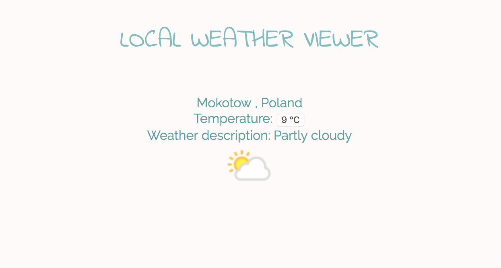

# Weather Viewer

### FreeCodeCamp challenge
#### by Paweł Kłeczek

Check it out on CodePen:
http://codepen.io/pawelkleczek/full/WGPRGw/

## What is this?

Weather viewer API uses geolocation function (Web API) to determine users exact location. Afterwards it prepares a query to Open Weather Map API to collect data about users location current weather information and displays it to the user. It uses pure CSS weather icons created by Josh Bader (http://codepen.io/joshbader/full/EjXgqr/). Mechanics uses some javascript, and Web API. User can change degrees from Celsius to Fahrenheit.

